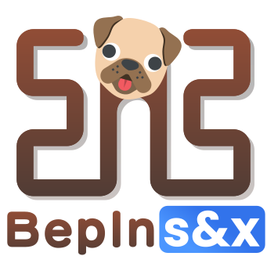

<p align="center">
    
</p>

# BepInS&x

Bepis Injector for standalone s&box

---

### BepInS&x is a fork of plugin / modding framework BepInEx 6, with added support for s&box.

All Unity Mono/IL2CPP/XNA/FNA/MonoGame support has been stripped in order to simplify the codebase; this fork only supports s&box.  
  
A barebones custom Doorstop implementation is also present, used to load a .NET host, which in turn is used to load BepInS&x.  

## Writing plugins  
A basic BepInS&x plugin looks like this:  
```CS
[BepInPlugin("SamplePlugin", "ciarencew.SamplePlugin", "1.0.0")] //This is what the chainloader will look for to load a plugin, it won't load without it
public class SamplePlugin : BaseSandboxPlugin
{
	protected override void OnAwake()
	{
		Logger.LogInfo("Hello, world!");
	}
}
```  
  
If you want your plugin to execute some code as soon as it's loaded by the chainloader, override the OnPluginLoad() method. This is the earliest possible entrypoint, outside of patchers. Be aware that due to how s&box loads scenes, any GameObject created during that time will get deleted.  
  
The BepInPlugin attribute is always needed once for each BaseSandboxPlugin. It provides vital information such as:  
- The name of the plugin (can be changed).  
- The GUID of the plugin (shouldn't be changed), used for the config, as well as other plugins' dependencies.  
- The version of the plugin, used for dependencies.  
  
The BaseSandboxPlugin class is derived from Sandbox.Component, it is the core of your plugin, and provides 3 useful Properties:  
- A `Logger`, use this to log things.  
- A `Config`, you can use this to load and save custom configs without having to worry about loading.  
- A `HarmonyInstance`, view [this](https://harmony.pardeike.net/articles/intro.html) and [that](https://github.com/BepInEx/HarmonyX/wiki) for more info.   
  
For more info, visit https://docs.bepinex.dev/articles/dev_guide/plugin_tutorial/index.html  

## Building  
To build BepInS&x, execute the build.cmd script. You'll also need to have s&box installed, and to have started it at least once.  
To build the Doorstop, just use VS2022 and build it from there :)

## Used libraries

- [BepInEx/HarmonyX](https://github.com/BepInEx/HarmonyX) - v2.10.4
- [MonoMod/MonoMod](https://github.com/MonoMod/MonoMod) - v25.0.8.0
- [jbevain/cecil](https://github.com/jbevain/cecil) - v0.10.4
- [dotnet/runtime](https://github.com/dotnet/runtime) - v9.0.9 (hostfxr, used by the Doorstop)

## License

The BepInS&x project is licensed under the LGPL-2.1 license.
